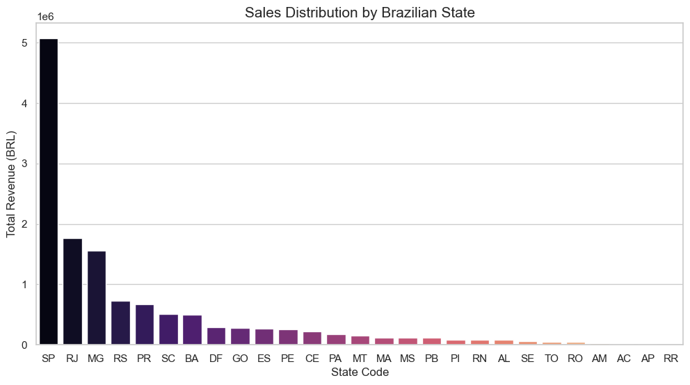

# 📊 Olist E-Commerce Data Intelligence Analysis
### *End-to-End Relational Data Analysis & Strategic Business Insights*

## 🚀 Project Overview
This project delivers a comprehensive deep-dive into the **Olist Brazilian E-commerce dataset**, analyzing over **100,000 orders** from 2016 to 2018. By integrating 9 relational datasets, this analysis uncovers critical trends in sales performance, regional market concentration, and logistics efficiency.

### 🏗️ Repository Architecture
To adhere to industry-standard data science workflows, the repository is structured as follows:
* **`data/`**: Centralized directory containing all raw relational CSV files.
* **`plots/`**: Curated visualizations including EDA charts and performance metrics.
* **`main.ipynb`**: Optimized Python notebook with modular code and updated pathing.
* **`requirements.txt`**: Complete list of dependencies for environment replication.

## 🛠️ Tech Stack & Methodology
* **Programming:** Python 3.x
* **Data Wrangling:** Pandas, NumPy
* **Data Visualization:** Matplotlib, Seaborn
* **Core Concepts:** Data Cleaning, Feature Engineering, Relational Mapping (Joins), and EDA.

## 📈 Key Business Intelligence (KBIs)
The analysis yielded high-impact insights for strategic decision-making:
1.  **Top Revenue Drivers:** The **'Health & Beauty'** and **'Watches & Gifts'** categories are the primary contributors to total GMV.
2.  **Market Concentration:** **São Paulo (SP)** is the dominant hub, representing over **40% of total customer density** and sales volume.
3.  **Payment Preferences:** **Credit Cards** are the most utilized payment method, facilitating nearly **75% of all transactions**.
4.  **Logistics Performance:** Identified clear correlations between geographic distance and delivery lead times, highlighting regional shipping bottlenecks.

## 🖼️ Visual Insights
|   Revenue by Product Category | Geographic Sales Distribution|
| :---: | :---: |
|   | 

## ⚙️ Setup & Installation
Follow these steps to replicate the analysis in your local environment:
1.  **Clone the Repo:** ```bash
    git clone [https://github.com/yk1082420-ai-ml2025/Olist-Ecommerce-Data-Intelligence.git](https://github.com/yk1082420-ai-ml2025/Olist-Ecommerce-Data-Intelligence.git)
   
2.  **Install Dependencies:**
    ```bash
    pip install -r requirements.txt
   
3.  **Execute Analysis:** Open `main.ipynb` in Jupyter Notebook or VS Code to view the full pipeline.

 👤 Contact & Connect
**Yogendra Kumar** * **LinkedIn:** [Your Professional Profile](https://www.linkedin.com/in/yogendrakumar-ai-ml2025)
* **GitHub:** [Project Repository](https://github.com/yk1082420-ai-ml2025/Olist-Ecommerce-Data-Intelligence)


